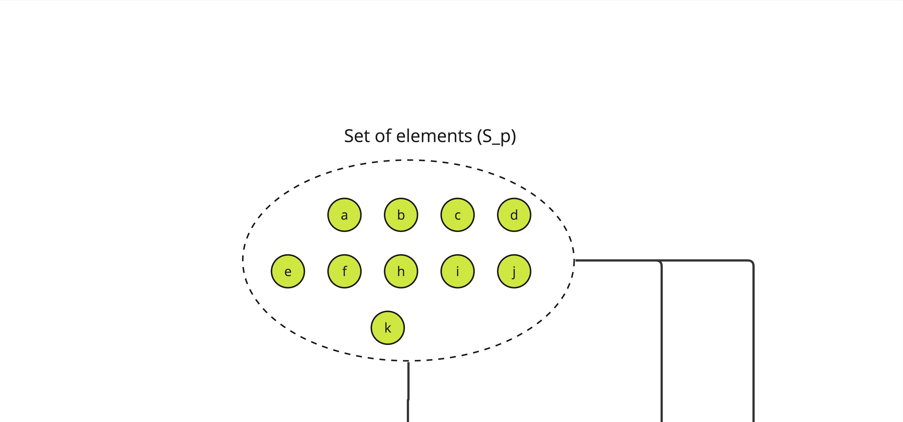
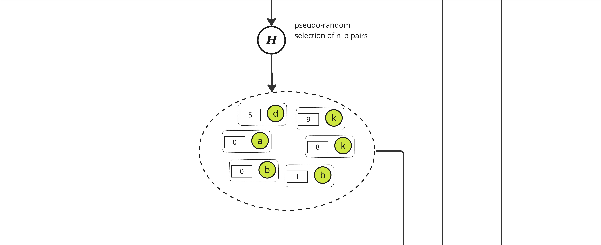
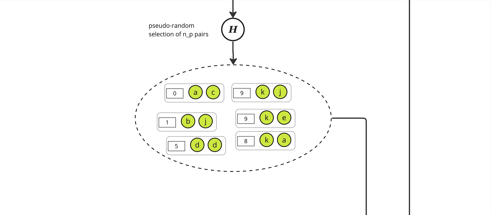
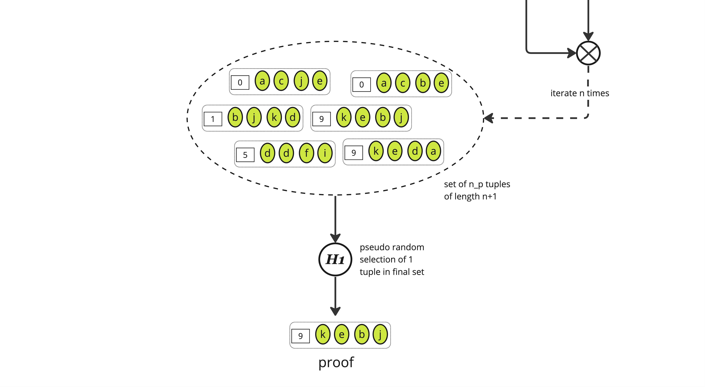
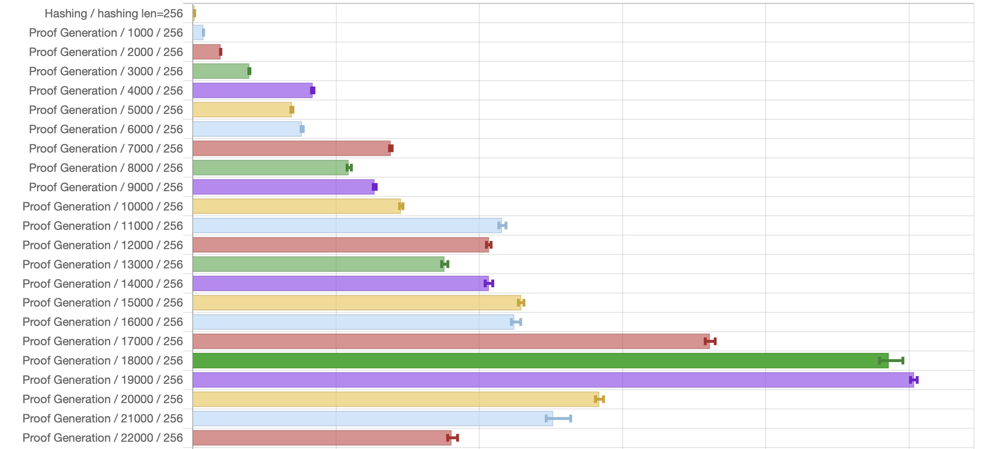
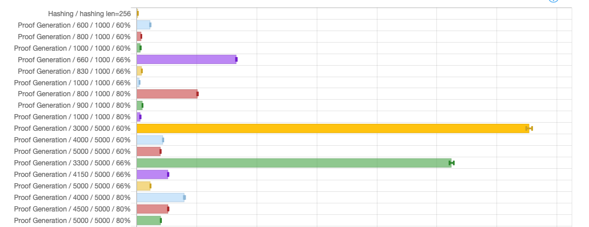

# ALBA

Prototype implementation of _Approximate Lower Bound Arguments_ from the [paper](https://iohk.io/en/research/library/papers/approximate-lower-bound-arguments/) published by IOG Research:

> **Approximate Lower Bound Arguments**,  _Pyrros Chaidos, Prof Aggelos Kiayias, Leonid Reyzin, Anatoliy Zinovyev_, May 2024, Eurocrypt'24

> [!IMPORTANT]
> This code is NOT fit for production, it's not been optimised, thoroughly tested, nor audited by competent cryptographers.
> Its one and only purpose is to help people who are more familiar with code than equations to have a better understanding of ALBAs

## Introduction

_Approximate Lower Bound Arguments_ are a form of cryptographic certificates that allow a _prover_ to convince a _verifier_ they know some large set of elements by providing only a small subset of those elements. This excellent [X thread](https://x.com/Quantumplation/status/1783188333046255997) provides a good intuition on why ALBAs are useful and how they work, and details of the theory behind this construction are beyond the scope of this introduction and can be found in the paper.

### Proving

Here is an alternative graphical representation of how ALBA certificates are produced, using the basic construction. We start with a set denote $S_p$ of elements such that each is _unique_ and its availability can be asserted by a verifier through some predicate (called $R$) in the paper.

> [!NOTE]
> The $S_p$ set can be smaller than the expected maximum number of elements we want to build a proof on, with a lower bound on $n_p$ the number of expected honest elements.



The first step is to construct the cartesian product of each element of $S_p$, here called $a$ through $k$, with all the integers lower than some parameter $d$, yielding a set of size $\|S_p\| \times d$


From this set, we pseudo-randomly select $n_p$ pairs using a "random oracle" $\mathbb{H}$. $\mathbb{H}$ is effectively just a hash function and to select the adequate number of pairs we pick those with a hash value modulo $n_p$ equals to 0, yielding a set of size roughly $n_p$ of pair of an integer and some item in $S_p$.

> [!NOTE]
> The ratio $n_p / n_f$ is a key factor when setting the needed length of the proof.



We then expand the set again, creating triples of an integer and 2 elements from $S_p$ through a cartesian product between the selected pairs and the initial set, yielding a set of size $\|S_p\| \times n_p$.


And we again pseudo-randomly select $n_p$ elements from this new set using the same function $\mathbb{H}$, yielding a set of triples of approximate size $n_p$



This process is iterated $n$ times according to the protocol parameters (see the paper or [the code](https://github.com/cardano-scaling/alba/blob/8893e4b2de2cb9d74f135ec4535fbfca6acf83d3/src/ALBA.hs#L162) for details on how these parameters are computed), yielding a set of (roughly) $n_p$ tuples of length $n+1$ where each tuple is some "random" integer along with $n$ items from $S_p$.

The last stage consists in applying a function $\mathbb{H}_1$ to select _one_ element from this set which is the final _proof_.




### Verifying

[Verifying](https://github.com/cardano-scaling/alba/blob/8893e4b2de2cb9d74f135ec4535fbfca6acf83d3/src/ALBA.hs#L259) a given proof $P$ is straightforward. Given the known share of honest items $n_p$ and a security parameter $\lambda$ (set at 128 in the paper) controlling the exponentially decaying probability a proof with dishonest items can be constructed, the verifier needs to check:

* The sequence of hashes from the items in the proof are all 0 modulo $n_p$,
* The value of $H_1$ for the whole sequence is 0 modulo some derived parameter $q$,
* And of course that each item in the sequence is valid w.r.t. the predicate $R$.

## Build

This code is written in Haskell with some native libraries dependencies for faster hashing. It requires the following software to be built:

* GHC
* Cabal
* [libsodium](https://doc.libsodium.org/)

To install sodium, you can follow instructions for [cardano-node](https://developers.cardano.org/docs/get-started/installing-cardano-node/#downloading--compiling) but please not ALBA does not depend (yet) on Cardano-specific sodium extensions.

GHC and Cabal can be installed through [GHCUp](https://www.haskell.org/ghcup/).

To build all components, assuming pkg-config is propertly configured and `libsodium` is installed:

```
cabal build all
```

To run tests:

```
cabal test
```
## Run

This package provides a small executable, unsurprisingly called `alba`, one can use to generate random data and proofs from those. It can also verify a given proof.

```
$ cabal run alba -- --help
alba: Command-line utility for creating and verifying ALBA proofs

Usage:
alba prove <options>  : Generate an ALBA proof file from a (random) set of items
alba verify <options> : Verify an ALBA proof. Note that options must be consistent with
                        the options used for proving

Options:
--help           : Display this help text
--security <int> : The security level of the proof (default: 128)
--size <int>     : The actual number of elements to build a proof for (default: 100)
--bound <int>    : The maximum number of elements in the input set (default: 100)
--len <int>      : The length (in bytes) of each item in the input set (default: 8)
--honest-ratio <int>
                 : The assumed _percentage_ of "honest" items in the input set (default: 80)
--output <file>  : The file containing proof to write or verify (default: alba.proof)
```

Here are a few examples use:

* Generate a proof for a set of size 900 from a maximum bound of 1000, assuming 80% honest ratio, with each item of length 256 bytes, in a file called `alba.proof`:

  ```
  $ cabal run alba -- prove --bound 1000 --size 900 --len 500 --output alba.proof
  Generating proof Options {size = 900, bound = 1000, len = 500, params = Params {λ_sec = 128, λ_rel = 128, n_p = 800, n_f = 200}, output = "alba.proof"}
  Written proof to 'alba.proof' (34557 bytes)
  ```

* Verifying the above generated proof with same parameters:

  ```
  $ cabal run alba -- verify --bound 1000 --size 900 --len 500 --output alba.proof
  Verifying proof with Options {size = 900, bound = 1000, len = 500, params = Params {λ_sec = 128, λ_rel = 128, n_p = 800, n_f = 200}, output = "alba.proof"}
  Verified proof Proof (6,["df5fd475c65f745cf63dc2705f33f8a9190460ffc97a0eaa9...
  ```

  A textual representation of the proof is dumped on the standard output.

* Generate a proof for a subset of elements smaller than $n_p$ blows up:

  ```
  $ cabal run alba -- prove --bound 1000 --size 700 --len 500 --output alba.proof
  ```

## Benchmarks

### Running benchmarks

This package comes with [criterion](http://www.serpentine.com/criterion/)-based benchmarks defined in the [ALBABench](bench/ALBABench.hs) module.
To run benchmarks and generate a nice HTML page:

```
cabal bench --benchmark-options '-o bench.html'
```

It should be relatively straightforward to tweak the benchmarks for different figures

### Sample results

This repository contains some specific benchmarks outputs formatted by criterion as HTML standalone pages:

[Simple benchmark](bench.html): Shows proving time for various number of items


Large benchmarks (in [HTML](bench-1000-100000.html) and [CSV](bench-1000-100000.csv)): Run time for all list of items from 1000 to 100000 stepped by 1000. The following picture represents a fraction of that data:



While the benchmark shows execution time is roughly linear as the number of items increases, there are locally wild variations: A smaller number of items could lead to a significantly larger execution time. This seems easily explainable by the fact the number of hashes executed depends on the "shape" of the tree of data one needs to traverse. Even with identical set of data, different number of items yields different values for parameters $d$, $u$ and $q$ which necessarily modify the computed hashes and therefore the depth-first search for a proof.

To confirm this hypothesis, the "Variance benchmark" runs prover with _different_ set of data for _same_ number of items. Running ALBA prover on 10 different lists of 5000 items yields also varying running time, with a difference of a factor 2 between slowest and fastest. Again, this is explanable by the "random" nature of the data: Different lists can lead to different traversal of the tree when constructing the proof, some requiring more hashes than others.

Variance benchmark (in [HTML](bench-5000x10.html) and [CSV](bench-5000x10.csv)): Run time for 10 different list of 5000 items


Size of prover input set (in [HTML](bench-size-bound.html) and [CSV](bench-size-bound.csv)): Run time for various values of `size` and `bound` number of items over varying honest ratio ($n_p$)



Note also the execution time increases as the number of items provided to the prover gets closer to the minimum expected number of honest items.

All these numbers were obtained on a single [C2, 4 CPUs, 16GB Ram](https://cloud.google.com/compute/docs/compute-optimized-machines#c2_series) machine from Google Cloud running Ubuntu 22.04.
